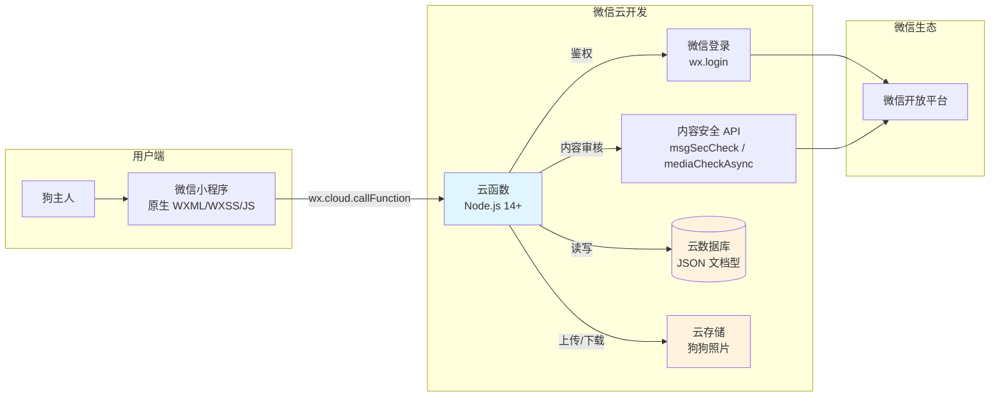

# 方案设计 · DogChat

> **状态**：草稿  
> **版本**：v1.0  
> **来源 PRD**：../../docs/PRD-v1.5.md  
> **关联现状**：新项目，无存量代码。调研素材见 PRD § 六（微信小程序社交类目、ICP 备案、个体工商户注册流程）  
> **最后更新**：2026-04-20

---

## 一、方案综述

**核心思路**：用微信小程序 + 微信云开发（Serverless）搭建一个以狗为主体的去中心化社交广播系统。狗主人以狗狗身份发布图文动态，仅狗友可见；同时支持轻量约遛工具。

**关键技术路径**：微信小程序原生前端 + 微信云开发 Node.js 云函数后端 + 云数据库（JSON 文档型）+ 云存储。利用微信生态天然鉴权和内容安全 API，零服务器运维。

**预期产出**：一个可上线的小程序，支持 10-30 位种子用户完成添加狗友、发动态、点赞评论、约遛的完整闭环。

**不做什么**（Out of Scope）：
- ❌ 陌生人推荐/附近的人（避免触发更严格的审核类目）
- ❌ IM 即时聊天（避免需要额外通信类目）
- ❌ 付费/交易/电商/广告/直播
- ❌ 多平台适配（仅微信小程序）
- ❌ 服务端渲染/SEO（小程序不需要）

---

## 二、架构设计

### 2.1 整体架构图



### 2.2 图示说明

- `方框` = 服务/模块
- `圆柱` = 数据存储
- `★` = 本次核心开发内容
- 箭头方向 = 调用/数据流方向

### 2.3 关键数据流

**发狗狗圈流程**：

```
用户点击发布 → 前端选择狗狗身份 → 填写内容/选图 → 前端调用 moment/create 云函数
→ 云函数调用 msgSecCheck 审核文本 → 云函数调用 mediaCheckAsync 审核图片（异步）
→ 审核通过 → 写入 moments 集合 → 返回成功 → 前端刷新信息流
```

**添加狗友流程**：

```
用户 A 进入"我的"→选狗→出示二维码（含 dogId）
用户 B 扫码 → 前端调用 friend/request 云函数 → 写入 friendships（status=pending）
用户 A 收到请求 → 确认 → 前端调用 friend/confirm → 更新 friendships（status=confirmed）
```

---

## 三、关键技术选型

### 3.1 前端框架

- **备选**：
  - A：微信小程序原生开发（WXML + WXSS + JS）
  - B：Taro（React 语法转多端）
  - C：uni-app（Vue 语法转多端）
- **结论**：**选 A**
- **理由**：
  - DogChat 仅微信小程序，不需要跨端
  - 原生开发零依赖，调试链路最短，微信开发者工具支持最好
  - Taro/uni-app 引入额外构建层，对 MVP 是 overhead
- **Trade-off**：放弃跨端能力。未来如果要出 H5/App 需要重写前端

### 3.2 后端方案

- **备选**：
  - A：微信云开发（Serverless 云函数）
  - B：微信云托管（Docker 容器）
  - C：自建服务器（阿里云/腾讯云 ECS + 域名）
- **结论**：**选 A**
- **理由**：
  - 零运维、零服务器配置、免域名备案（小程序备案即可）
  - 与小程序 IDE 深度集成，一键部署云函数
  - 开发阶段完全免费（至 2026.12.31），上线后 19.9 元/月
  - 天然鉴权（云函数内免鉴权获取 openid）
- **Trade-off**：绑定微信生态，后期迁移困难；仅支持 Node.js；冷启动 800ms-2s

### 3.3 数据库

- **备选**：
  - A：云数据库（JSON 文档型，内置）
  - B：云托管 MySQL（关系型）
  - C：第三方 MongoDB Atlas
- **结论**：**选 A**
- **理由**：
  - 与云函数同环境，无需额外配置连接
  - JSON 文档结构天然匹配狗狗档案、动态等非结构化数据
  - 内置权限控制（安全规则）
- **Trade-off**：无事务支持（云数据库不支持多文档事务），需用应用层补偿

### 3.4 状态管理

- **备选**：
  - A：小程序原生全局状态（App.js globalData + 事件通知）
  - B：MobX/MobX-Weapp
  - C：Redux + 小程序适配层
- **结论**：**选 A**
- **理由**：
  - DogChat 状态复杂度低（当前用户、狗狗列表、狗友列表、动态列表）
  - 原生方案足够，引入第三方库增加 bundle 体积和学习成本
- **Trade-off**：状态逻辑分散在各页面，后期复杂化后需重构

### 3.5 图片处理

- **备选**：
  - A：前端压缩后上传云存储（wx.compressImage + wx.cloud.uploadFile）
  - B：云函数端压缩（sharp 库）
  - C：使用云存储 CDN 自动压缩
- **结论**：**选 A**
- **理由**：
  - 小程序原生支持图片压缩，无需额外依赖
  - 减少云函数执行时间和内存消耗
  - 云存储自动生成缩略图（通过 URL 参数）
- **Trade-off**：压缩质量由前端控制，不如服务端精细

---

## 四、详细设计

### 4.1 用户与登录模块

**职责**：微信授权登录，创建/关联用户记录。

**流程**：
1. 小程序调用 `wx.login()` 获取 code
2. 前端调用 `user/login` 云函数，传入 code
3. 云函数通过 `cloud.getWXContext()` 获取 openid（免鉴权）
4. 查询 users 集合，不存在则创建新用户记录
5. 返回用户基本信息

**数据模型**：

```javascript
// users 集合
{
  _openid: "oXXXXXXXXXXXXXXXX",  // 云开发自动关联
  nickName: "张三",
  avatarUrl: "https://...",
  createTime: Date,
  updateTime: Date
}
```

**关键约束**：
- 不存储用户微信敏感信息（unionid 可选，但 MVP 不需要）
- 登录后把 openid 缓存在前端 `wx.setStorageSync`

### 4.2 狗狗档案模块

**职责**：创建、编辑、查询狗狗档案。一个用户可有多只狗。

**数据模型**：

```javascript
// dogs 集合
{
  _id: "auto-generated",
  dogId: "DG_20260420_001",      // 业务 ID，系统生成
  ownerId: "oXXXXXXXXXXXXXXXX",  // 关联用户 openid
  name: "小七",
  avatar: "cloud://...",         // 云存储文件 ID
  breed: "柴犬",                  // 可选
  age: 3,                         // 可选，岁
  gender: "male",                 // 可选
  tags: ["活泼", "爱吃"],         // 可选
  createTime: Date,
  updateTime: Date
}
```

**关键逻辑**：
- dogId 生成规则：`DG_${YYYYMMDD}_${3位随机数}`，创建时检查唯一性
- 头像上传：前端 `wx.chooseImage` → `wx.compressImage` → `wx.cloud.uploadFile`
- 每只狗有一个专属二维码，内容：`dogchat://dog/${dogId}`

### 4.3 狗友关系模块

**职责**：建立和维护狗与狗之间的双向好友关系。

**数据模型**：

```javascript
// friendships 集合
{
  _id: "auto-generated",
  dogId: "DG_20260420_001",        // 发起方
  friendDogId: "DG_20260420_002",  // 接收方
  status: "confirmed",              // pending | confirmed | rejected
  createTime: Date,
  confirmTime: Date
}
```

**关键逻辑**：
- 关系是双向的，但只存一条记录（dogId < friendDogId 排序，避免重复）
- 查询某狗的所有狗友：`db.collection('friendships').where(_.or([{dogId: x}, {friendDogId: x}]))`
- 添加狗友时检查是否已存在关系，避免重复请求

### 4.4 狗狗圈（动态）模块

**职责**：发布和浏览狗友动态。核心功能。

**数据模型**：

```javascript
// moments 集合
{
  _id: "auto-generated",
  momentId: "MM_20260420_001",
  dogId: "DG_20260420_001",        // 发布者（狗的身份）
  content: "今天和小七去了公园...", // 文本内容
  images: ["cloud://...", "cloud://..."], // 云存储文件 ID 数组
  likeCount: 5,
  commentCount: 3,
  createTime: Date
}

// comments 集合
{
  _id: "auto-generated",
  commentId: "CM_20260420_001",
  momentId: "MM_20260420_001",
  dogId: "DG_20260420_002",        // 评论者（狗的身份）
  content: "好可爱！",
  createTime: Date
}

// likes 集合
{
  _id: "auto-generated",
  momentId: "MM_20260420_001",
  dogId: "DG_20260420_002",        // 点赞者（狗的身份）
  createTime: Date
}
```

**关键逻辑**：
- **内容安全审核**：发布时先调用 `msgSecCheck`（同步），图片调用 `mediaCheckAsync`（异步，返回 traceId，轮询结果）
- **信息流查询**：先查当前用户的所有 dogId → 查这些 dogId 的所有狗友 → 查狗友发布的 moments → 按时间倒序 → 分页（每次 20 条）
- **点赞去重**：likes 集合以 `(momentId, dogId)` 为复合唯一键
- **评论显示**：前端根据 dogId 查 dogs 集合，显示为"小七的主人"（从 ownerId 反查用户昵称）

### 4.5 约遛模块

**职责**：发起和响应遛狗邀约。

**数据模型**：

```javascript
// walks 集合
{
  _id: "auto-generated",
  walkId: "WK_20260420_001",
  dogId: "DG_20260420_001",        // 发起者
  time: "2026-04-22 18:00",        // 约遛时间
  location: "朝阳公园南门",         // 地点
  latitude: 39.93,                  // 纬度（可选）
  longitude: 116.45,                // 经度（可选）
  invitedDogIds: ["DG_002", "DG_003"],
  responses: [
    { dogId: "DG_002", status: "accepted", respondTime: Date },
    { dogId: "DG_003", status: "pending" }
  ],
  createTime: Date,
  status: "active"                  // active | cancelled | completed
}
```

**关键逻辑**：
- 发起约遛时，被邀请的狗友在"约遛"Tab 看到待响应列表
- 响应状态：pending → accepted / declined
- 约遛发起人可取消邀约

### 4.6 内容安全模块

**职责**：拦截违规文本和图片，确保通过微信审核。

**文本审核流程**：
```
用户提交内容 → 云函数调用 security.msgSecCheck({content})
→ 返回 {errCode: 0} = 通过
→ 返回 {errCode: 87014} = 违规，拒绝发布并提示用户"内容包含敏感信息"
```

**图片审核流程**：
```
用户上传图片 → 云函数调用 security.mediaCheckAsync({media_url, media_type: 2})
→ 返回 traceId
→ 云函数轮询查询结果（或等待微信异步回调）
→ 审核通过后才写入 moments
```

**关键约束**：
- 文本审核同步阻塞，图片审核异步非阻塞
- 审核失败的内容不写入数据库，前端提示用户修改
- 所有 UGC（用户生成内容）必须经过审核

### 4.7 云数据库安全规则

```javascript
{
  "read": true,  // 云函数端读取不受限（云函数有管理员权限）
  "write": "auth != null"  // 仅登录用户可写
}
```

**注意**：云数据库的安全规则只限制**前端直接访问**。DogChat 所有数据库操作都通过云函数，云函数有管理员权限，不受安全规则限制。真正的权限控制放在云函数业务逻辑中实现（例如：只能删除自己的动态）。

---

## 五、Trade-off 分析

| Trade-off | 我们选择 | 放弃的是 | 原因 |
|---|---|---|---|
| 绑定微信生态 vs 跨平台自由 | 绑定微信（云开发） | 未来迁移到其他平台的便利性 | MVP 阶段快速上线优先，迁移是远期问题 |
| 数据一致性 vs 开发速度 | 最终一致（无事务） | 强事务保证 | 云数据库不支持多文档事务，社交场景最终一致可接受 |
| 前端压缩 vs 服务端压缩 | 前端压缩 | 更精细的压缩控制 | 减少云函数执行时间和成本 |
| 原生开发 vs 框架开发 | 原生小程序 | 跨端能力和现代开发体验 | 仅微信小程序，原生链路最短 |
| 实时推送 vs 轮询 | 轮询 + 服务通知 | 实时 WebSocket | 小程序 WebSocket 增加复杂度，社交动态对实时性要求不高 |

---

## 六、风险与缓解

| 风险 | 可能性 | 影响 | 缓解措施 | 责任人 |
|---|---|---|---|---|
| 云开发冷启动导致用户体验差 | 中 | 中 | 用定时触发器保活（每 5 分钟空调一次）；MVP 阶段影响小 | RD |
| 内容安全 API 误判正常内容 | 中 | 中 | 审核失败时给用户明确提示，允许修改重发；不自动删除 | RD |
| 云数据库查询性能差（狗友动态流） | 低-中 | 中 | 为 dogs.dogId、friendships.dogId/friendDogId、moments.dogId 建索引；分页查询 | RD |
| 云开发免费额度到期后成本上升 | 确定 | 低 | 上线后 19.9 元/月基础套餐足够支撑；监控用量 | RD |
| 微信审核因内容安全机制不完善被驳回 | 中 | 高 | 确保所有 UGC 都过 msgSecCheck + mediaCheckAsync；提供测试账号 | RD |
| 云数据库无事务导致数据不一致 | 低 | 中 | 应用层补偿：发布动态时先写 moments，再异步更新计数；失败时重试 | RD |

---

## 七、开放问题

- ❓ **图片审核异步回调 vs 轮询**：`mediaCheckAsync` 是异步的，需要决定是前端轮询还是云函数等回调。轮询实现简单但增加请求量；回调需要配置消息推送。建议 MVP 用轮询。
- ❓ **多狗切换的 UX**：一个用户有多只狗时，发狗狗圈需要选择"以哪只狗的身份发"。这个交互需要设计（底部弹出选择器？默认最近活跃的狗？）。
- ❓ **约遛的时间冲突检测**：是否需要检测同一时间段已有约遛？MVP 阶段可以不做，让用户自己判断。

---

## 附录：工程目录结构

```
DogChat/
├── miniprogram/                    # 小程序前端
│   ├── app.js                      # 全局入口
│   ├── app.json                    # 全局配置
│   ├── app.wxss                    # 全局样式
│   ├── pages/
│   │   ├── index/                  # 狗狗圈首页
│   │   ├── publish/                # 发布动态
│   │   ├── walk/                   # 约遛狗
│   │   ├── walk-detail/            # 约遛详情
│   │   ├── profile/                # 我的
│   │   ├── dog-profile/            # 狗狗资料页
│   │   ├── dog-edit/               # 编辑狗狗资料
│   │   ├── dog-friends/            # 狗友列表
│   │   └── dog-qr/                 # 狗狗二维码
│   ├── components/
│   │   ├── moment-card/            # 动态卡片
│   │   ├── comment-list/           # 评论列表
│   │   ├── walk-card/              # 约遛卡片
│   │   └── dog-selector/           # 狗狗选择器
│   └── utils/
│       ├── api.js                  # 云函数调用封装
│       └── format.js               # 时间格式化等
├── cloudfunctions/                 # 云函数
│   ├── user/
│   │   └── login/
│   │       └── index.js
│   ├── dog/
│   │   ├── create/
│   │   ├── update/
│   │   └── list/
│   ├── friend/
│   │   ├── request/
│   │   ├── confirm/
│   │   └── list/
│   ├── moment/
│   │   ├── create/
│   │   ├── list/
│   │   ├── like/
│   │   └── comment/
│   └── walk/
│       ├── create/
│       ├── respond/
│       └── list/
├── docs/
│   └── PRD-v1.5.md
└── specs/
    └── dogchat/
        ├── plan.md
        ├── task.md
        └── verification.md
```
