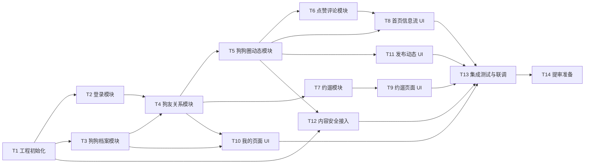

# 实现任务清单 · DogChat

> **来源 Plan**：./plan.md  
> **关联验证**：./verification.md  
> **任务总数**：14  
> **预估总工时**：58 小时  
> **最后更新**：2026-04-20

---

## 进度汇总

| 状态 | 数量 |
|---|---|
| ✅ 已完成 | 0 / 14 |
| 🔄 进行中 | 0 |
| ⏸️ 等待依赖 | 0 |
| 📋 待开始 | 14 |

> Checkbox 由 `e2e-code-review-loop` 主 Agent 集中回写，Sub-Agent 不直接修改本文件。

---

## 任务依赖图

---

## 任务列表

### T1：工程初始化与云开发环境配置
- [ ] **状态**：pending
- **依赖**：无
- **预估**：3 小时
- **仓库/文件**：`DogChat/`（新建项目根目录）
- **关联 Plan 章节**：plan.md § 4.7（安全规则）、附录（目录结构）
- **关联验收**：verification.md § 1（编译验证）
- **任务描述**：
  初始化微信小程序项目，开通微信云开发环境。
  1. 在微信开发者工具中创建新项目，选择"小程序"+"云开发"
  2. 配置云开发环境 ID
  3. 创建云函数目录结构（cloudfunctions/user/login/、cloudfunctions/dog/create/ 等）
  4. 创建小程序页面目录结构（pages/index/、pages/profile/ 等）
  5. 配置 app.json 页面路由和 tabBar
  6. 初始化云数据库安全规则（plan.md § 4.7）
  7. 提交初始 commit
- **验收**：
  - [ ] 微信开发者工具能正常编译运行
  - [ ] 云开发控制台可访问
  - [ ] 目录结构与 plan.md 附录一致
  - [ ] `git log` 有初始 commit

### T2：用户登录与授权模块
- [ ] **状态**：pending
- **依赖**：T1
- **预估**：4 小时
- **仓库/文件**：
  - `cloudfunctions/user/login/index.js`（新建）
  - `miniprogram/pages/login/login.js`（新建）
  - `miniprogram/app.js`（修改，添加全局登录状态）
- **关联 Plan 章节**：plan.md § 4.1
- **关联验收**：verification.md § 2（单测验证）
- **任务描述**：
  实现微信授权登录流程。
  1. 前端：登录页调用 `wx.login()` 获取 code，调用 `user/login` 云函数
  2. 云函数：通过 `cloud.getWXContext()` 获取 openid，查询/创建 users 集合记录
  3. 前端：登录成功后缓存 openid 到 `wx.setStorageSync`，跳转首页
  4. 全局：App.js 启动时检查登录状态，未登录跳转登录页
  5. users 集合字段按 plan.md § 4.1 定义
- **验收**：
  - [ ] 新用户首次登录自动创建 users 记录
  - [ ] 老用户登录直接返回已有记录
  - [ ] 登录状态持久化，关闭小程序后重新打开仍保持登录
  - [ ] 未登录用户访问任何页面被拦截到登录页

### T3：狗狗档案模块（后端）
- [ ] **状态**：pending
- **依赖**：T1
- **预估**：5 小时
- **仓库/文件**：
  - `cloudfunctions/dog/create/index.js`（新建）
  - `cloudfunctions/dog/update/index.js`（新建）
  - `cloudfunctions/dog/list/index.js`（新建）
- **关联 Plan 章节**：plan.md § 4.2
- **关联验收**：verification.md § 2
- **任务描述**：
  实现狗狗档案的 CRUD 云函数。
  1. `dog/create`：生成 dogId（规则 `DG_${YYYYMMDD}_${3位随机数}`），检查唯一性，写入 dogs 集合
  2. `dog/update`：根据 dogId 更新字段（name、breed、age、gender、tags）
  3. `dog/list`：根据当前用户 openid 查询其所有狗狗
  4. 头像上传：前端 `wx.chooseImage` → `wx.compressImage` → `wx.cloud.uploadFile`，返回 fileID 存入 dogs.avatar
  5. dogs 集合字段按 plan.md § 4.2 定义
- **验收**：
  - [ ] 能创建狗狗档案，dogId 唯一
  - [ ] 能更新狗狗资料
  - [ ] 能列出当前用户的所有狗狗
  - [ ] 头像上传成功，返回云存储 fileID

### T4：狗友关系模块（后端）
- [ ] **状态**：pending
- **依赖**：T2, T3
- **预估**：6 小时
- **仓库/文件**：
  - `cloudfunctions/friend/request/index.js`（新建）
  - `cloudfunctions/friend/confirm/index.js`（新建）
  - `cloudfunctions/friend/list/index.js`（新建）
- **关联 Plan 章节**：plan.md § 4.3
- **关联验收**：verification.md § 2
- **任务描述**：
  实现狗友关系的建立和查询。
  1. `friend/request`：接收 dogId + friendDogId，检查是否已存在关系，写入 friendships（status=pending）
  2. `friend/confirm`：接收 dogId + friendDogId，更新 friendships（status=confirmed）
  3. `friend/list`：接收 dogId，查询该狗的所有 confirmed 狗友（用 `_.or` 查 dogId 和 friendDogId 两端）
  4. 关系记录排序：dogId < friendDogId 字典序，避免重复
  5. friendships 集合字段按 plan.md § 4.3 定义
- **验收**：
  - [ ] A 向 B 发起请求，friendships 写入 pending 记录
  - [ ] B 确认后，记录更新为 confirmed
  - [ ] 查询某狗的狗友列表返回正确
  - [ ] 重复请求被拦截（返回"已是狗友"或"请求已发送"）

### T5：狗狗圈动态模块（后端）
- [ ] **状态**：pending
- **依赖**：T4
- **预估**：6 小时
- **仓库/文件**：
  - `cloudfunctions/moment/create/index.js`（新建）
  - `cloudfunctions/moment/list/index.js`（新建）
- **关联 Plan 章节**：plan.md § 4.4
- **关联验收**：verification.md § 2
- **任务描述**：
  实现动态发布和信息流查询。
  1. `moment/create`：接收 dogId + content + images[]，生成 momentId，写入 moments 集合
  2. `moment/list`：接收 dogId，查询该狗的所有 confirmed 狗友 → 查询这些狗友发布的 moments → 按 createTime 倒序 → 分页（每次 20 条）
  3. moments 集合字段按 plan.md § 4.4 定义
  4. 图片上传在客户端完成，云函数只接收 cloud:// fileID 数组
- **验收**：
  - [ ] 能发布图文动态
  - [ ] 信息流只返回狗友的动态（非狗友的不出现）
  - [ ] 信息流按时间倒序
  - [ ] 分页正确（第 2 页不重复第 1 页数据）

### T6：点赞评论模块（后端）
- [ ] **状态**：pending
- **依赖**：T5
- **预估**：4 小时
- **仓库/文件**：
  - `cloudfunctions/moment/like/index.js`（新建）
  - `cloudfunctions/moment/comment/index.js`（新建）
- **关联 Plan 章节**：plan.md § 4.4
- **关联验收**：verification.md § 2
- **任务描述**：
  实现点赞和评论功能。
  1. `moment/like`：接收 momentId + dogId，检查是否已点赞（likes 集合查重），未点赞则写入，已点赞则删除（取消点赞）
  2. `moment/comment`：接收 momentId + dogId + content，写入 comments 集合，更新 moments.commentCount
  3. likes 和 comments 集合字段按 plan.md § 4.4 定义
  4. 点赞去重：以 (momentId, dogId) 为复合查询条件
- **验收**：
  - [ ] 点赞成功，likes 集合有记录
  - [ ] 重复点赞自动取消（toggle 逻辑）
  - [ ] 评论成功，comments 集合有记录，moments.commentCount 更新

### T7：约遛模块（后端）
- [ ] **状态**：pending
- **依赖**：T4
- **预估**：5 小时
- **仓库/文件**：
  - `cloudfunctions/walk/create/index.js`（新建）
  - `cloudfunctions/walk/respond/index.js`（新建）
  - `cloudfunctions/walk/list/index.js`（新建）
- **关联 Plan 章节**：plan.md § 4.5
- **关联验收**：verification.md § 2
- **任务描述**：
  实现约遛的创建、响应和查询。
  1. `walk/create`：接收 dogId + time + location + invitedDogIds[]，生成 walkId，写入 walks 集合（status=active）
  2. `walk/respond`：接收 walkId + dogId + status（accepted/declined），更新 walks.responses 数组
  3. `walk/list`：接收 dogId，查询该狗作为发起者或被邀请者的所有 active 约遛
  4. walks 集合字段按 plan.md § 4.5 定义
- **验收**：
  - [ ] 能发起约遛，invitedDogIds 正确存储
  - [ ] 被邀请狗能响应 accepted/declined
  - [ ] 列表查询返回该狗相关的所有约遛

### T8：首页狗狗圈信息流 UI
- [ ] **状态**：pending
- **依赖**：T5, T6
- **预估**：6 小时
- **仓库/文件**：
  - `miniprogram/pages/index/index.wxml`（新建）
  - `miniprogram/pages/index/index.wxss`（新建）
  - `miniprogram/pages/index/index.js`（新建）
  - `miniprogram/components/moment-card/`（新建）
  - `miniprogram/components/comment-list/`（新建）
- **关联 Plan 章节**：plan.md § 二（架构）、§ 4.4
- **关联验收**：verification.md § 3（BOE 集成测试）
- **任务描述**：
  实现狗狗圈首页 UI。
  1. 顶部：当前狗狗身份切换器（如果用户有多只狗）
  2. 中部：动态信息流列表，每条动态显示：狗狗头像+名字、内容、图片（九宫格）、点赞数、评论数、发布时间
  3. 底部：点赞按钮（toggle）、评论输入框
  4. 下拉刷新、上拉加载更多（分页）
  5. 点击动态进入详情页（可查看全部评论）
  6. 使用 moment-card 组件封装单条动态
- **验收**：
  - [ ] 信息流正确显示狗友动态
  - [ ] 下拉刷新加载最新数据
  - [ ] 上拉加载更多（分页）
  - [ ] 点赞按钮 toggle 状态正确
  - [ ] 评论输入后实时显示在列表中

### T9：约遛页面 UI
- [ ] **状态**：pending
- **依赖**：T7
- **预估**：5 小时
- **仓库/文件**：
  - `miniprogram/pages/walk/walk.wxml`（新建）
  - `miniprogram/pages/walk/walk.wxss`（新建）
  - `miniprogram/pages/walk/walk.js`（新建）
  - `miniprogram/pages/walk-detail/walk-detail.*`（新建）
  - `miniprogram/components/walk-card/`（新建）
- **关联 Plan 章节**：plan.md § 4.5
- **关联验收**：verification.md § 3
- **任务描述**：
  实现约遛 Tab 的 UI。
  1. 约遛列表：显示我发起的和我被邀请的约遛，按时间排序
  2. 每条约遛显示：发起狗狗头像+名字、时间、地点、响应状态
  3. 发起约遛按钮：弹出表单（选择时间、地点、邀请狗友）
  4. 被邀请者可点击"接受"或"拒绝"
  5. 点击约遛进入详情页，显示全部响应状态
  6. 使用 walk-card 组件封装单条约遛
- **验收**：
  - [ ] 约遛列表正确显示
  - [ ] 能发起新约遛
  - [ ] 被邀请者能响应
  - [ ] 详情页显示全部响应

### T10：我的页面与狗狗管理 UI
- [ ] **状态**：pending
- **依赖**：T2, T3, T4
- **预估**：6 小时
- **仓库/文件**：
  - `miniprogram/pages/profile/profile.*`（新建）
  - `miniprogram/pages/dog-profile/dog-profile.*`（新建）
  - `miniprogram/pages/dog-edit/dog-edit.*`（新建）
  - `miniprogram/pages/dog-friends/dog-friends.*`（新建）
  - `miniprogram/pages/dog-qr/dog-qr.*`（新建）
- **关联 Plan 章节**：plan.md § 4.2、§ 4.3
- **关联验收**：verification.md § 3
- **任务描述**：
  实现"我的"Tab 的全部页面。
  1. 我的页面：显示用户昵称头像、我的狗狗列表（卡片式）
  2. 点击狗狗进入狗狗资料页：显示狗狗详细信息、狗友数量、出示二维码按钮
  3. 狗狗资料页：编辑按钮 → 进入编辑页（修改名字、品种、年龄等）
  4. 狗友列表页：显示该狗的所有狗友（头像+名字）
  5. 二维码页：生成该狗的二维码（内容 `dogchat://dog/${dogId}`），支持保存到相册
  6. 添加狗狗按钮：进入创建流程（同首次创建）
- **验收**：
  - [ ] 我的页面显示用户信息和狗狗列表
  - [ ] 能编辑狗狗资料
  - [ ] 狗友列表正确显示
  - [ ] 二维码能生成并保存
  - [ ] 能添加新狗狗

### T11：发布动态 UI
- [ ] **状态**：pending
- **依赖**：T3, T5
- **预估**：4 小时
- **仓库/文件**：
  - `miniprogram/pages/publish/publish.*`（新建）
- **关联 Plan 章节**：plan.md § 4.4
- **关联验收**：verification.md § 3
- **任务描述**：
  实现发布动态页面。
  1. 选择以哪只狗的身份发布（底部弹出选择器，如果有多只狗）
  2. 文本输入框（最多 500 字）
  3. 图片选择器（最多 9 张）：`wx.chooseImage` → `wx.compressImage` → `wx.cloud.uploadFile`
  4. 发布按钮：调用 `moment/create` 云函数
  5. 发布成功后返回首页并刷新信息流
  6. 发布中显示 loading，失败提示错误信息
- **验收**：
  - [ ] 能选择发布狗狗身份
  - [ ] 能选择并上传图片（最多 9 张）
  - [ ] 发布成功后首页刷新
  - [ ] 发布失败有明确错误提示

### T12：内容安全审核接入
- [ ] **状态**：pending
- **依赖**：T1, T5
- **预估**：4 小时
- **仓库/文件**：
  - `cloudfunctions/moment/create/index.js`（修改，添加审核逻辑）
  - `cloudfunctions/utils/secCheck.js`（新建，审核工具函数）
- **关联 Plan 章节**：plan.md § 4.6
- **关联验收**：verification.md § 2、§ 3
- **任务描述**：
  接入微信内容安全 API，确保所有 UGC 过审。
  1. 创建 `utils/secCheck.js` 工具模块，封装 `msgSecCheck` 和 `mediaCheckAsync`
  2. `moment/create` 云函数中，写入数据库前先调用 `msgSecCheck` 审核文本
  3. 文本审核失败（errCode=87014）返回错误，不写入数据库
  4. 图片审核：调用 `mediaCheckAsync`，返回 traceId，轮询查询结果
  5. MVP 阶段图片审核策略：同步等待轮询结果（最多 3 次，每次 2 秒），超时则拒绝发布
  6. 审核失败给用户明确提示："内容包含敏感信息，请修改后重试"
- **验收**：
  - [ ] 含敏感词的文本被拒绝发布
  - [ ] 正常文本通过审核并发布成功
  - [ ] 图片审核流程正确（含违规图片被拒绝）
  - [ ] 审核失败有明确用户提示

### T13：集成测试与联调
- [ ] **状态**：pending
- **依赖**：T8, T9, T10, T11, T12
- **预估**：6 小时
- **仓库/文件**：
  - 全部前端页面和云函数
- **关联 Plan 章节**：plan.md § 二（架构）
- **关联验收**：verification.md § 3（BOE 集成测试）
- **任务描述**：
  端到端联调，验证完整用户流程。
  1. 流程 A：注册登录 → 创建狗狗 → 出示二维码 → 另一用户扫码添加狗友 → 确认
  2. 流程 B：发布动态（图文）→ 狗友在首页看到 → 点赞 → 评论
  3. 流程 C：发起约遛 → 狗友收到 → 接受 → 查看约遛详情
  4. 流程 D：内容安全测试（发布敏感词、违规图片）
  5. 边界测试：无狗友时的空状态、多狗切换、网络异常处理
  6. 性能测试：信息流加载速度、图片加载速度
- **验收**：
  - [ ] 4 个核心流程全部跑通
  - [ ] 内容安全机制生效
  - [ ] 空状态和网络异常有友好提示
  - [ ] 首页信息流加载 < 3 秒（含冷启动）

### T14：提审准备
- [ ] **状态**：pending
- **依赖**：T13
- **预估**：4 小时
- **仓库/文件**：
  - `miniprogram/` 全部代码
  - 微信公众平台后台配置
- **关联 Plan 章节**：plan.md § 六（合规与上线）
- **关联验收**：verification.md § 4（PPE 验证）
- **任务描述**：
  准备微信代码审核所需材料。
  1. 确保所有页面无"敬请期待"空壳
  2. 确保登录流程允许先体验再授权（首页可浏览，操作时才弹登录）
  3. 准备测试账号：2 个微信号，各自有狗狗档案和狗友关系
  4. 准备测试数据：每个测试账号有 3-5 条动态、1-2 条约遛
  5. 填写小程序审核备注：说明功能、提供测试账号密码
  6. 检查内容安全 API 是否全部接入
  7. 上传代码并提交审核
- **验收**：
  - [ ] 所有页面功能完整
  - [ ] 测试账号数据准备完毕
  - [ ] 审核备注填写完整
  - [ ] 代码成功提交审核

---

## 备注

- 任务按拓扑序排列，同层可并行
- T1-T7 为后端云函数开发，T8-T11 为前端页面开发，可部分并行（例如 T3 和 T8 不直接依赖）
- 实际执行时可根据人力调整并行度
- 任何任务若在 Sub-Agent 执行时发现上下文不足，返回 `NEEDS_CONTEXT`，主 Agent 补充后重派
